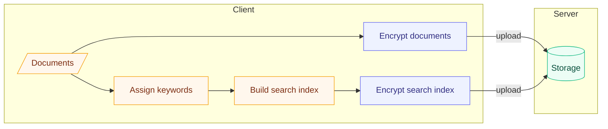
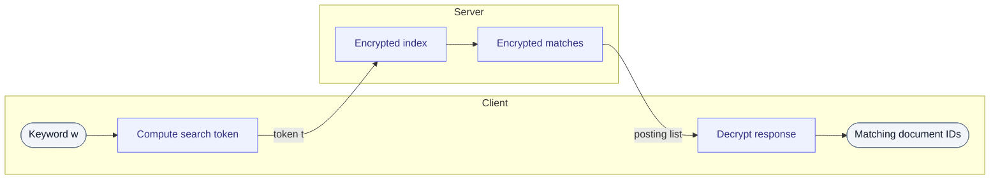

> **Status:** Active · **Role:** Solo · **Timeline:** Nov 2026
{: .prompt-info }

## Overview

Searchable Symmetric Encryption (SSE) allows a client to securely store an encrypted database on a server while retaining the ability to issue keyword queries. In a typical SSE scheme, the client encrypts each document, computes an encrypted search index, and uploads both to the server. To retrieve documents matching a particular keyword, the client sends a search token derived from the keyword; the server then performs a lookup against the search index and returns all document IDs matching the token.
Although the underlying keywords and document contents are never revealed to the server in this scheme, the _access pattern_—the binary vector returned by passing a token through the search index—is revealed. This paper proposes a universal data preprocessing step that reduces data dependencies and defends against attacks that rely on this leakage.
    
## Links

- **Source:** [github.com/testoupr/<repo>](https://github.com/testoupr/<repo>)
- **Paper / writeup:** [PDF](#)

## Tech Stack

| Layer | Tools |
|---|---|
| Language | Python 3.12 |
| Libraries | NumPy|
| Infra | Docker, GitHub Actions |

## How It Works

Searchable Symmetric Encryption (SSE) begins by building an encrypted search index. A database can be represented as a matrix 
$$
D =
\begin{bmatrix}
d_{11} & d_{12} & \cdots & d_{1m} \\
d_{21} & d_{22} & \cdots & d_{2m} \\
\vdots & \vdots & \ddots & \vdots \\
d_{n1} & d_{n2} & \cdots & d_{nm}
\end{bmatrix}
\in \{0,1\}^{\,n \times m},
\qquad
d_{ij} =
\begin{cases}
1 & \text{if document } i \text{ contains keyword } j,\\
0 & \text{otherwise.}
\end{cases}
$$

In more detail, setup proceeds directly from $D$:

1. For each keyword $w_j$, the client gathers the identifiers of the documents that contain it — the non-zero entries of the $j$-th column of $D$. Collecting these lists over all keywords yields an *inverted index* that maps every keyword to its matching documents.
2. To conceal the keywords, each is replaced by a *label* derived from a pseudorandom function $F$ under a secret key $K$ held only by the client, and the associated list of document identifiers is encrypted under the same key.
3. The resulting encrypted index, together with the individually encrypted documents, is uploaded to the server. Lacking $K$, the server learns neither the keywords, nor the document contents, nor the structure of the index.

Concretely, the encrypted index is a table keyed by these labels,

$$
\mathrm{EDB} = \Bigl\{\, F_K(w_j) \ \mapsto\ \mathrm{Enc}_K\!\bigl(D_{\cdot,j}\bigr) \,\Bigr\}_{j=1}^{m},
$$

where $D_{\cdot,j}$ is the $j$-th column of $D$ — the indicator vector of the documents containing keyword $j$.

### Querying

A search touches only the corresponding label, so no keyword is ever sent to the server in the clear:

1. The client computes the *search token* $t = F_K(w)$ for the queried keyword $w$ and sends $t$ to the server.
2. The server uses $t$ as a lookup key into the encrypted index, retrieves the matching encrypted list, and returns it.
3. The client decrypts the response to recover the identifiers of the matching documents, and fetches or decrypts those documents as needed.

Because $F$ is deterministic, a given keyword always maps to the same label — precisely what lets the server answer a query without ever learning the keyword.

### The access pattern

The keywords and document contents remain hidden, but the server still observes *which* documents each query returns. A query on keyword $w_j$ reveals exactly its set of matching documents — the $j$-th column

$$
D_{\cdot,j} =
\begin{bmatrix} d_{1j} \\ d_{2j} \\ \vdots \\ d_{nj} \end{bmatrix}
\in \{0,1\}^{n}.
$$

This returned indicator vector is the query's *access pattern*. A single access pattern reveals little on its own, but observed across many queries it exposes structure in $D$ that an adversary can exploit — the leakage this work sets out to reduce.

## Highlights / Results

What you're proud of — benchmarks, a tricky problem solved, a screenshot.

## What's Next

- [ ] Planned item one
- [ ] Planned item two
