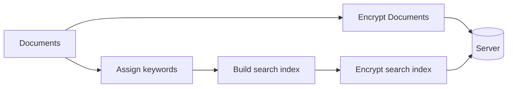

> **Status:** Active · **Role:** Solo · **Timeline:** Nov 2026
{: .prompt-info }

## Overview

Searchable Symmetric Encryption (SSE) allows a client to securely store an encrypted database on a server while retaining the ability to issue keyword queries. In a typical SSE scheme, the client encrypts each document, computes an encrypted search index, and uploads both to the server. To retrieve documents matching a particular keyword, the client sends a search token derived from the keyword; the server then performs a lookup against the search index and returns all document IDs matching the token.
Although the underlying keywords and document contents are never revealed to the server in this scheme, the _access pattern_—the binary vector returned by passing a token through the search index—is revealed. This paper proposes a universal data preprocessing step that reduces data dependencies and defends against attacks that rely on this leakage.
    
## Links

- **Source:** [github.com/testoupr/<repo>](https://github.com/testoupr/<repo>)
- **Paper / writeup:** [PDF](#)

## Tech Stack

| Layer | Tools |
|---|---|
| Language | Python 3.12 |
| Libraries | NumPy|
| Infra | Docker, GitHub Actions |

## How It Works

Searchable Symmetric Encryption (SSE) begins by building an encrypted search index. A database can be represented as a matrix 
$$
D =
\begin{bmatrix}
d_{11} & d_{12} & \cdots & d_{1m} \\
d_{21} & d_{22} & \cdots & d_{2m} \\
\vdots & \vdots & \ddots & \vdots \\
d_{n1} & d_{n2} & \cdots & d_{nm}
\end{bmatrix}
\in \{0,1\}^{\,n \times m},
\qquad
d_{ij} =
\begin{cases}
1 & \text{if document } i \text{ contains keyword } j,\\
0 & \text{otherwise.}
\end{cases}
$$

## Highlights / Results

What you're proud of — benchmarks, a tricky problem solved, a screenshot.

## What's Next

- [ ] Planned item one
- [ ] Planned item two
