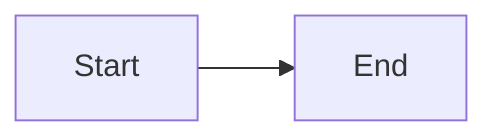

# Component Dictionary

Copy-paste reference for writing posts. Each entry: what it does + the syntax.
Live examples all render in the **Component Showcase** post (`/posts/component-showcase/`).

---

## Panels (prompts) — colored callout boxes

A `>` quote, then an attribute line right under it.

```markdown
> Your text here.
{: .prompt-tip }
```

- `.prompt-tip` → 🟢 green (advice)
- `.prompt-info` → 🔵 blue (note)
- `.prompt-warning` → 🟡 yellow (caution)
- `.prompt-danger` → 🔴 red (danger)

Leave off the `{: ... }` line for a plain grey quote.

---

## Text styles

```markdown
**bold**   *italic*   ~~strikethrough~~   `inline code`   [link text](https://url.com)
```

**Filepath** — styles text like a path: `` `_config.yml`{: .filepath } ``

---

## Headings

```markdown
## Section        (biggest you should use in a post)
### Sub-section
#### Smaller
```

`#` (h1) is the post title — don't use it in the body.

---

## Lists

```markdown
- bullet
  - nested (indent 2 spaces)

1. numbered
2. numbered

- [ ] to-do, unchecked
- [x] to-do, done
```

---

## Table

`:` sets column alignment (left / center / right).

```markdown
| Left | Center | Right |
|:-----|:------:|------:|
| a    | b      | c     |
```

---

## Code block (with filename tab)

```` markdown
```python
print("hi")
```
{: file="hello.py" }
````

Swap `python` for `bash`, `js`, `c`, etc. for the right colors. The `{: file="..." }`
line is optional.

> If your code contains `{{ ... }}` or `` (Jinja, Liquid, Vue), wrap the whole
> post body in `` … `` or Jekyll will try to run it.
{: .prompt-warning }

---

## Images

```markdown
{: w="500" }
_Caption goes here in italics._
```

- Path starts at `/assets/...` (put files in `assets/img/`).
- `w="500"` sets width in px. Add `.shadow` for a drop shadow: `{: w="500" .shadow }`.

**Cover image** (banner + feed thumbnail) — goes in the front matter, not the body:

```yaml
image:
  path: /assets/img/posts/my-post/cover.png
  alt: describe the image
```

---

## Math  (needs `math: true` in front matter)

```markdown
Inline: $E = mc^2$

Block:
$$ a^2 + b^2 = c^2 $$
```

---

## Diagram  (needs `mermaid: true` in front matter)

```` markdown

````

---

## Footnote

```markdown
A claim.[^1]

[^1]: The note, placed anywhere (renders at the bottom).
```

---

## Front-matter flags (the `---` block at the top)

```yaml
---
title: My Post
date: 2026-08-10 12:00:00 -0700
categories: [Top, Sub]     # max 2, hierarchical
tags: [lowercase, tags]    # any number
description: One-line summary for previews/SEO.
pin: true                  # float to top of home page
math: true                 # enable $...$ math
mermaid: true              # enable diagrams
toc: false                 # hide the table of contents (on by default)
comments: false            # hide comments on this post
---
```
