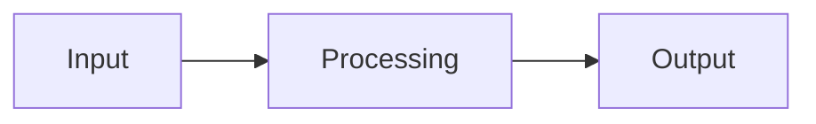

> **Status:** Active · **Role:** Solo · **Timeline:** 2026 –
{: .prompt-info }

## Overview

Two or three sentences: what problem it solves, who it's for, and the headline result.

## Links

- **Source:** [github.com/testoupr/<repo>](https://github.com/testoupr/<repo>)
- **Live demo:** [<url>](https://example.com)
- **Paper / writeup:** [PDF](#)

## Features

- ✨ Key feature one
- ⚡ Key feature two
- 🔒 Key feature three

## Tech Stack

| Layer | Tools |
|---|---|
| Language | Python 3.12 |
| Libraries | NumPy, pandas |
| Infra | Docker, GitHub Actions |

## How It Works

Explain the approach. A diagram helps — with `mermaid: true` in the front matter you can write:

## Highlights / Results

What you're proud of — benchmarks, a tricky problem solved, a screenshot.

{: w="700" }
_What the screenshot shows._

## What's Next

- [ ] Planned item one
- [ ] Planned item two
